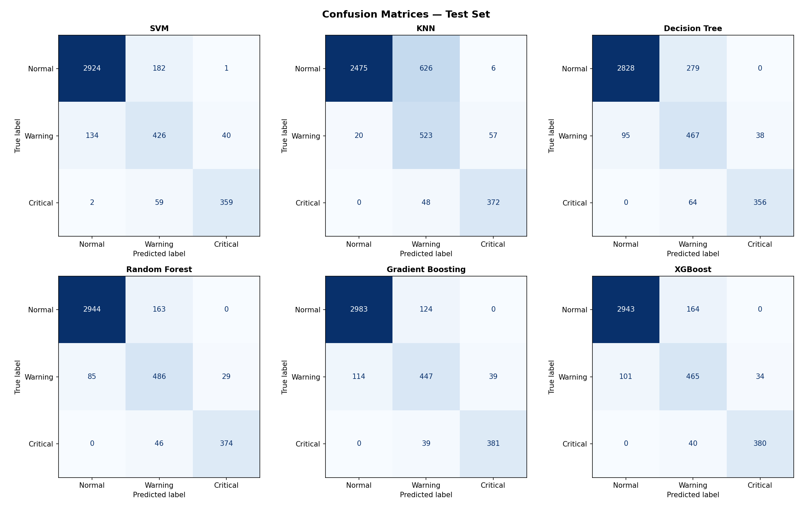

# Predictive Maintenance for CNC Machines

End-to-end machine learning system that classifies turbofan engine health into three states — Normal, Warning, and Critical — using NASA CMAPSS sensor data. Built with a full ML pipeline, REST API, and interactive React dashboard.

---

## Problem Statement

Industrial machines degrade over time. Unplanned failures are costly. This system uses historical sensor readings from turbofan engines to predict whether an engine is operating normally, approaching failure (warning), or in a critical state — enabling proactive maintenance decisions.

---

## Project Structure

```
predictive-maintenance/
├── data/
│   └── train_FD001.txt          # NASA CMAPSS dataset
├── notebooks/
│   └── predictive_maintenance.ipynb
├── outputs/
│   ├── f1_comparison.png
│   ├── all_metrics_comparison.png
│   ├── confusion_matrices.png
│   └── learning_curves.png
├── backend/
│   ├── app.py
│   ├── train_regressor.py
│   └── requirements.txt
├── frontend/
│   └── src/
│       ├── components/
│       │   ├── Dashboard.jsx
│       │   ├── Predict.jsx
│       │   └── Sidebar.jsx
│       ├── App.jsx
│       └── index.css
├── requirements.txt
└── README.md
```

---

## Dataset

**NASA CMAPSS Turbofan Engine Degradation Simulation — FD001**

- 100 engines run to failure
- 20,631 total cycle readings
- 21 sensor channels + 3 operational settings
- Download: https://www.kaggle.com/datasets/bishals098/nasa-turbofan-engine-degradation-simulation

---

## ML Pipeline

### Target Variable
Engine health state derived from Remaining Useful Life (RUL):

| Class    | RUL Threshold     |
|----------|-------------------|
| Normal   | RUL > 50 cycles   |
| Warning  | 20 < RUL ≤ 50     |
| Critical | RUL ≤ 20 cycles   |

### Feature Engineering
- Dropped low-variance sensors (std < 0.1)
- Rolling mean and rolling std (window = 5 cycles) per engine unit
- Final feature matrix: 36 features

### Class Balancing
SMOTE applied only on training folds inside cross-validation to prevent data leakage.

### Models Compared

| Model             | Accuracy | Precision | Recall | F1 Score |
|-------------------|----------|-----------|--------|----------|
| Random Forest     | 96.59%   | 96.64%    | 96.59% | 96.60%   |
| SVM               | 96.25%   | 96.34%    | 96.25% | 96.25%   |
| Gradient Boosting | 95.27%   | 95.29%    | 95.27% | 95.28%   |
| XGBoost           | 95.24%   | 95.28%    | 95.24% | 95.25%   |
| KNN               | 92.85%   | 93.96%    | 92.85% | 92.79%   |
| Decision Tree     | 86.84%   | 87.11%    | 86.84% | 86.89%   |

Evaluation: 5-Fold Stratified Cross Validation

**Best Model: Random Forest — 96.60% Macro F1**

---

## Backend

Flask REST API serving the trained Random Forest model.

**Endpoints:**

| Method | Endpoint         | Description                        |
|--------|------------------|------------------------------------|
| GET    | /health          | API status check                   |
| POST   | /predict         | Single row prediction              |
| POST   | /predict_batch   | Batch prediction for full engine   |

**Run locally:**
```bash
cd backend
pip install -r ../requirements.txt
python train_regressor.py   # generates rul_model.pkl
python app.py               # starts on port 5000
```

---

## Frontend

React dashboard built with Recharts and Vite.

**Pages:**
- Dashboard — model performance comparison, F1 chart, radar metrics, class distribution
- Predict — enter sensor values manually, get real-time health prediction with RUL estimate and probability breakdown

**Run locally:**
```bash
cd frontend
npm install
npm run dev     # starts on port 3000
```

---

## Setup — Full Local Run

```bash
# 1. Clone the repo
git clone https://github.com/subhrajit08/predictive-maintenance.git
cd predictive-maintenance

# 2. Download dataset

# 3. Install Python dependencies
pip install -r requirements.txt

# 4. Train models (from notebook or directly)
cd backend
python train_regressor.py

# 5. Start backend
python app.py

# 6. Start frontend (new terminal)
cd frontend
npm install
npm run dev
```

Open `http://localhost:3000`

---

## Notebook

`notebooks/predictive_maintenance.ipynb` covers:

1. Data loading and inspection
2. Exploratory data analysis — RUL distribution, sensor degradation plots
3. Feature engineering — rolling statistics, low variance sensor removal
4. Preprocessing — stratified split, SMOTE
5. Model training — 5-fold cross validation across 6 models
6. Performance comparison — F1 bar chart, all metrics comparison
7. Confusion matrices — per model on test set
8. Learning curves — top 3 models
9. Final summary and model selection

---

## Result



---

## Tech Stack

| Layer     | Technology                              |
|-----------|-----------------------------------------|
| ML        | scikit-learn, XGBoost, imbalanced-learn |
| Backend   | Flask, Flask-CORS, joblib               |
| Frontend  | React, Vite, Recharts, Axios            |
| Data      | pandas, numpy, matplotlib, seaborn      |
| Dataset   | NASA CMAPSS FD001                       |

---

## Key Design Decisions

- SMOTE applied inside CV folds only — prevents synthetic samples from leaking into validation
- Rolling features computed per engine unit — captures local degradation trends
- Recall prioritized for Critical class — missing a real failure is more costly than a false alarm
- RUL regression model runs alongside classifier — gives estimated cycles remaining

---

## License

This project is licensed under the MIT License.